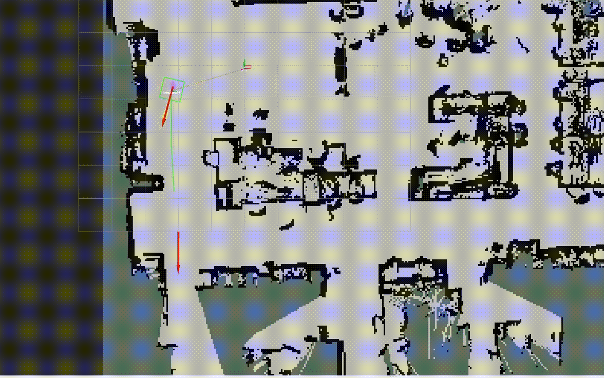

# Robotics-Project
Polytechnic of Milan - Year 2023-2024

Authors: <b>Samuele Giammusso</b> & <b>Samuele Faccincani</b> 

# Project 1

### Description
Slide of the [first](Slide%20Lab/Project_1) project

### How to run it

Firstly, you need to build the docker image, follow the guide at the end of the page

Open a terminal in the `robotics/docker` folder

Run `./run_vnc.sh`

Run `./run_docker_vnc.sh`

Type `tmux`

Compile the project with `catkin_make` (if it gives an error, run it 3-4 times)

Open another tmux pane with `Ctrl+B %`

Run `roslaunch first_project launch.launch` in the first pane

Move to the other pane with `Ctrl+B arrow left`

In the second pane `cd src/bags` and then run `rosbag play --clock robotics.bag`

Open the browser and head to `localhost:8080/vnc.html` to see it working

# Project 2

### Description
Slide of the [second](Slide%20Lab/Project_2) project

### How to run it

The steps are the same as before, but this time the launch file and the bag file are different

#### Mapping

For the mapping part, in the first pane run `cd src/bags` and then run `rosbag play --clock robotics2.bag`

Move to the other pane and run `roslaunch second_project mapping.launch`

#### Navigation

For the navigation part, stop the execution of mapping with `Ctrl+C` for both the launch file and the bag file

Run `roslaunch second_project navigation.launch`

# Useful Files

- [Summary of Laboratory Classes](Lab%20summary)
- [Docker and ROS source files](robotics)
- [Laboratory slides](Slide%20Lab/Lectures_1) for the first half of the course
- [Laboratory slides](Slide%20Lab/Lectures_2) for the second half of the course
- [Bash script](robotics/comandi_docker.sh) for changing tmux keyboard shortcuts

### How to build docker image (on linux)

Install docker from [here](https://docs.docker.com/engine/install/)

Then, to check if docker is running, run `docker run hello-world`

Head to the folder `robotics/docker` and then run `./build.sh`

